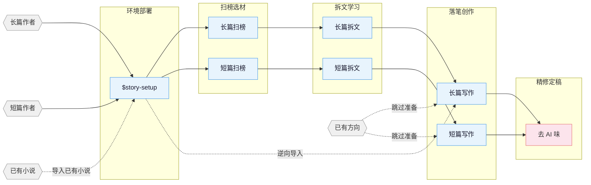

[English](README_EN.md) | **中文**

# oh-story-claudecode

Codex 专属网文写作插件，覆盖长篇与短篇网络小说的扫榜、拆文、写作、去AI味、封面图全流程。插件通过 `.codex-plugin/plugin.json` 暴露 skills，并通过 `$story-setup` 在写作项目中部署 Codex agents 与 hooks。

## 核心思路

> **套路 = 确定性的情绪满足**

专业作者的方法论三步走：

1. **扫榜**：分析热门榜单，洞察题材、人设、切入点。
2. **拆文**：拆解大纲节奏与剧情素材，建立个人模块库。
3. **商业化写作**：学习并运用钩子、爽感、期待感等核心技巧。

围绕四条线展开：爆款逆向 · 剧情模块化重组 · 上下文状态分层管理 · 人机协同。

> v0.7.0 起：仓库改造为 Codex 专属插件，保留 `.codex-plugin/plugin.json`、`skills/`、`.codex/agents/*.toml` 与 `.codex/hooks.json` 部署路径，移除其他软件兼容层。
>
> v0.6.21 起：短篇写作参考栈瘦身，`story-short-write` 改由 `short-format` / `short-craft` / `short-deslop` 和四个题材包承接短篇格式、情绪直给、节奏密度和去 AI 味。

## 流程总览



## 安装

这是 Codex 专属插件，只支持 Codex 插件安装与 Codex 项目部署。

### 本地开发使用

仓库根目录包含 Codex 插件清单：

```text
.codex-plugin/plugin.json
```

插件清单直接指向仓库内 `skills/` 目录。把本仓库作为本地 Codex 插件源安装或加入个人 marketplace 后，新开 Codex 会话即可使用 `$story`、`$story-setup` 与 `/skills` 触发各个 skill。

### 写作项目部署

在目标写作项目中运行 `$story-setup`。部署会写入：

```text
.codex/agents/*.toml
.codex/hooks.json
.codex/hooks/story_codex_hook.py
.codex/skills/story-setup/references/agent-references/
AGENTS.md
.story-deployed
```

部署后需要信任项目 `.codex/` 配置，并新开 Codex 会话，让 custom agents 和 hooks 稳定生效。

升级后如果项目里已经跑过 `$story-setup`，建议在项目根目录重跑一次 `$story-setup`，同步 hooks、agents 与 references。每版变更见 [CHANGELOG.md](CHANGELOG.md) 与 [Releases](https://github.com/worldwonderer/oh-story-claudecode/releases)。

> 多 agent 协作要先部署再新开会话：7 个专业 agent（story-architect、narrative-writer、consistency-checker 等）由 `$story-setup` 写入项目 `.codex/agents/*.toml`。判断是否生效：新会话里跑 `$story-review`，报告头是 `Effective Mode: full/lean` 即注册成功，是 `Fallback: ... -> solo` 说明当前运行时未暴露项目 custom agent。

## Skills

| Skill | 触发 | 说明 |
|:------|:-----|:-----|
| `story-setup` | `$story-setup` `/skills` `/准备写书` | Codex 写作项目部署 · 写入 `.codex/agents`、hooks 与 AGENTS.md |
| `story` | `$story` `/skills` `/网文` | 工具箱路由 · 模糊意图自动分发到对应 skill |
| `story-long-write` | `$story-long-write` `/写长篇` | 长篇写作 · 大纲搭建、人物设定、正文输出 |
| `story-long-analyze` | `$story-long-analyze` | 长篇拆文 · 黄金三章、爽点设计、节奏分析 |
| `story-long-scan` | `$story-long-scan` | 长篇扫榜 · 起点/番茄/晋江市场趋势 |
| `story-short-write` | `$story-short-write` | 短篇写作 · 情绪设计、反转构思、精修出稿 |
| `story-short-analyze` | `$story-short-analyze` | 短篇拆文 · 故事核、结构分析、情感线、反转设计、写作手法、共鸣分析 |
| `story-short-scan` | `$story-short-scan` | 短篇扫榜 · 知乎盐言/番茄短篇风口数据 |
| `story-deslop` | `$story-deslop` `/去AI味` | 去AI味 · 检测并清除 AI 写作痕迹 |
| `story-import` | `$story-import` `/导入小说` | 逆向导入 · 将已有小说反向解析为标准项目结构 |
| `story-review` | `$story-review` `/审查` | 多视角审查 · 4 Agent 多视角审稿 + 番茄/起点/知乎评分标准 |
| `story-cover` | `$story-cover` `/封面` | 封面生成 · 书名题材分析 + GPT-Image-2 出图 |
| `browser-cdp` | `$browser-cdp` | 浏览器操控 · CDP 协议复用登录态抓取数据 |

自然语言同样触发：

- 「帮我开书」→ `story-long-write`
- 「这篇太 AI 了」→ `story-deslop`
- 「把我的书导进来」→ `story-import`
- 「沈栀现在什么状态」→ 自动 spawn `story-explorer` agent

## Agent 体系

写作 skill 内部通过 7 个 Codex custom agents 协作，各司其职：

| Agent | 职责 |
|:------|:-----|
| **story-architect** | 故事架构 · 题材定位、大纲结构、钩子/反转设计、情绪弧线 |
| **character-designer** | 角色设计 · 角色档案、语言风格、动机链、对话创作 |
| **narrative-writer** | 叙事写手 · 正文写作、去AI味、格式合规 |
| **consistency-checker** | 一致性检查 · 事实冲突扫描、伏笔追踪、S1-S4 分级报告 |
| **story-researcher** | 资料研究 · CDP 搜索+正文提取、多源交叉验证、结构化参考文件输出 |
| **story-explorer** | 故事查询 · 角色/伏笔/设定/进度只读查询，日更上下文快速加载 |
| **chapter-extractor** | 章节提取 · 摘要+情节点+角色提及，并行拆文核心单元 |

Agent 按需加载 `references/` 中的写作理论，不预占上下文。

## 自动化 Hooks

`$story-setup` 部署后，Codex hooks 会提供：

| Hook | 触发时机 | 功能 |
|:-----|:---------|:-----|
| SessionStart | 会话开始/恢复 | 显示项目状态、连续性提示、上下文恢复建议 |
| PreToolUse | 写入正文前 | 缺对应细纲/小节大纲时阻止首次创建正文 |
| PreCompact | 上下文压缩前 | 保存进度快照路径和行数摘要 |
| PostCompact | 上下文压缩后 | 提示读取进度快照恢复上下文 |
| Stop | 回合结束 | 扫描本轮改动正文，执行截断/复读/工程词等兜底检查 |

## 项目文件结构

**长篇：**

```text
{书名}/
├── 设定/
├── 大纲/
├── 正文/
├── 对标/
├── 追踪/
└── 参考资料/
```

**短篇：**

```text
短篇/{标题}/
├── 正文.md
├── 小节大纲.md
└── 拆文库/
```

**拆文库：** 拆文 skill 默认输出到项目根目录 `拆文库/{书名}/`，产出结构化目录（角色/剧情/设定/章节）。

**`.active-book`：** 项目根目录的文本文件，内容是当前活跃书目的相对路径（如 `长篇/我的小说`），hook 和写作 skill 据此定位当前项目。

## 适用平台

**长篇** 起点中文网 · 番茄小说 · 晋江文学城 · 七猫小说 · 刺猬猫

**短篇** 知乎盐言故事 · 番茄短篇 · 七猫短篇

真实产出样例见 [demo/](demo/)：短篇拆文《曾将爱意私藏》· 长篇拆文《盘龙》· 长篇续写工程《让你管账号，你高燃混剪炸全网》· 封面《剑道独尊》示例图。

## 贡献

欢迎贡献新 skill、补充知识库、更新市场数据。详见 [CONTRIBUTING.md](CONTRIBUTING.md)。

## 交流

- **Telegram 群**：<https://t.me/ohstoryclaudecode> —— 日常交流、踩坑、新功能讨论。
- **GitHub Discussions**：[提问 / 求助 / 分享用法](https://github.com/worldwonderer/oh-story-claudecode/discussions)，方便检索。

## 致谢

- [LINUX DO - The New Ideal Community](https://linux.do) — 社区支持
- [FanqieRankTracker](https://github.com/wen1701/FanqieRankTracker) — 番茄小说字体反爬解码方案参考
