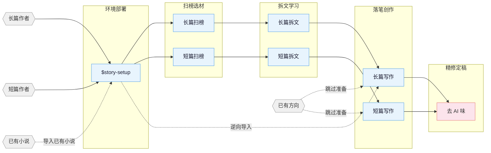

# oh-story-codex

Codex 专属网文写作插件，基于 [worldwonderer/oh-story-claudecode](https://github.com/worldwonderer/oh-story-claudecode) 改编。

这个仓库的核心方法论、技能体系和大量写作知识库来自原项目。感谢原作者 worldwonderer 对网文写作工作流、拆文方法、AI 去味、项目部署与多 agent 协作体系的长期打磨。本项目是在原有成果上的 Codex 专属化改造，不是原项目的官方发布版；如果你需要原版、历史版本或其他平台兼容能力，请优先访问原仓库。

## 改编目标

本分支只面向 Codex 使用，不再兼容其他软件或旧部署路径。

- 保留 Codex 插件入口：`.codex-plugin/plugin.json`
- 保留技能目录：`skills/`
- 保留 Codex 项目部署层：`.codex/agents/*.toml`、`.codex/hooks.json`、`.codex/hooks/story_codex_hook.py`
- 移除其他平台适配器、旧 marketplace、旧模板、旧同步脚本和旧 CI
- 将文档、hooks、agents 和检查脚本统一改为 Codex-only 语义

## 核心思路

> **套路 = 确定性的情绪满足**

原项目沉淀的写作方法论仍是本插件的基础：

1. **扫榜**：分析热门榜单，洞察题材、人设、切入点。
2. **拆文**：拆解大纲节奏与剧情素材，建立个人模块库。
3. **商业化写作**：学习并运用钩子、爽感、期待感等核心技巧。

整体围绕四条线展开：爆款逆向、剧情模块化重组、上下文状态分层管理、人机协同。

## 安装

在 Codex 中安装这个插件仓库：

```text
Install this Codex plugin https://github.com/wxy123-wh/oh-story-codex
```

安装后新开 Codex 会话，可通过 `$story`、`$story-setup` 或 `/skills` 调用技能。

## 写作项目部署

在目标写作项目根目录运行：

```text
$story-setup
```

部署会写入或更新：

```text
AGENTS.md
.codex/agents/*.toml
.codex/hooks.json
.codex/hooks/story_codex_hook.py
.codex/skills/story-setup/references/agent-references/
.story-deployed
```

部署后需要在 Codex 中信任项目 `.codex/` 配置，并新开会话，让 custom agents 和 hooks 稳定加载。

## 流程总览



## Skills

| Skill | 触发 | 说明 |
|:------|:-----|:-----|
| `story-setup` | `$story-setup` | Codex 写作项目部署，写入 agents、hooks 与 AGENTS.md |
| `story` | `$story` | 工具箱路由，按模糊意图分发到对应 skill |
| `story-long-write` | `$story-long-write` | 长篇写作：大纲搭建、人物设定、正文输出 |
| `story-long-analyze` | `$story-long-analyze` | 长篇拆文：黄金三章、爽点设计、节奏分析 |
| `story-long-scan` | `$story-long-scan` | 长篇扫榜：起点、番茄、晋江等市场趋势 |
| `story-short-write` | `$story-short-write` | 短篇写作：情绪设计、反转构思、精修出稿 |
| `story-short-analyze` | `$story-short-analyze` | 短篇拆文：故事核、结构、情感线、反转设计 |
| `story-short-scan` | `$story-short-scan` | 短篇扫榜：知乎盐言、番茄短篇等风口数据 |
| `story-deslop` | `$story-deslop` | 去 AI 味：检测并清除 AI 写作痕迹 |
| `story-import` | `$story-import` | 逆向导入：将已有小说解析为标准项目结构 |
| `story-review` | `$story-review` | 多视角审查：多 agent 审稿与平台评分标准 |
| `story-cover` | `$story-cover` | 封面生成：书名题材分析与出图提示词 |
| `browser-cdp` | `$browser-cdp` | 浏览器操控：通过 CDP 复用登录态抓取数据 |

自然语言也可以触发常见工作流，例如：

- “帮我开书” → `story-long-write`
- “这篇太 AI 了” → `story-deslop`
- “把我的书导进来” → `story-import`
- “某个角色现在什么状态” → `story-explorer`

## Codex Agents

`$story-setup` 会部署 7 个 Codex custom agents：

| Agent | 职责 |
|:------|:-----|
| `story-architect` | 故事架构：题材定位、大纲结构、钩子、反转、情绪弧线 |
| `character-designer` | 角色设计：角色档案、语言风格、动机链、对话创作 |
| `narrative-writer` | 叙事写手：正文写作、去 AI 味、格式合规 |
| `consistency-checker` | 一致性检查：事实冲突、伏笔追踪、分级报告 |
| `story-researcher` | 资料研究：搜索、提取、多源交叉验证、参考文件输出 |
| `story-explorer` | 故事查询：角色、伏笔、设定、进度只读查询 |
| `chapter-extractor` | 章节提取：摘要、情节点、角色提及，并行拆文核心单元 |

多 agent 协作需要先运行 `$story-setup`，然后新开 Codex 会话。可以用 `$story-review` 检查当前是否进入 full/lean 模式；如果进入 solo fallback，通常说明当前会话还没有加载项目 custom agents。

## 自动化 Hooks

部署后，Codex hooks 会提供以下护栏：

| Hook | 触发时机 | 功能 |
|:-----|:---------|:-----|
| SessionStart | 会话开始/恢复 | 显示项目状态、连续性提示、上下文恢复建议 |
| PreToolUse | 写入正文前 | 缺对应细纲或小节大纲时阻止首次创建正文 |
| PreCompact | 上下文压缩前 | 保存进度快照路径和行数摘要 |
| PostCompact | 上下文压缩后 | 提示读取进度快照恢复上下文 |
| Stop | 回合结束 | 扫描本轮改动正文，做截断、复读、工程词等兜底检查 |

## 项目结构

长篇项目推荐结构：

```text
{书名}/
├── 设定/
├── 大纲/
├── 正文/
├── 对标/
├── 追踪/
└── 参考资料/
```

短篇项目推荐结构：

```text
短篇/{标题}/
├── 正文.md
├── 小节大纲.md
└── 拆文库/
```

项目根目录可使用 `.active-book` 标记当前活跃书目的相对路径，hooks 和写作 skill 会据此定位当前项目。

## 验证脚本

本 Codex-only 改造保留的主要检查脚本：

```bash
scripts/check-codex-adapter.sh
scripts/static-check.sh
scripts/test-codex-hooks.sh
scripts/check-python-invocation.sh
scripts/check-shared-files.sh
scripts/test-ai-patterns.sh
scripts/test-degeneration.sh
```

## 致谢

特别感谢 [worldwonderer/oh-story-claudecode](https://github.com/worldwonderer/oh-story-claudecode) 原作者 worldwonderer。这个 Codex-only 分支建立在原项目的技能设计、网文方法论、拆文输出规范、AI 去味规则、agent 分工和 hooks 护栏之上。

也感谢原项目 README 中提到的相关社区和参考项目：

- [LINUX DO - The New Ideal Community](https://linux.do)
- [FanqieRankTracker](https://github.com/wen1701/FanqieRankTracker)

## 说明

本仓库是面向个人使用习惯的 Codex 专属改编版。原项目仍是方法论和历史演进的主要来源；本仓库后续只维护 Codex 插件安装、Codex agents、Codex hooks 和相关技能内容。
